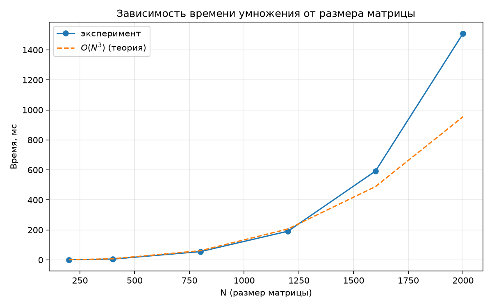
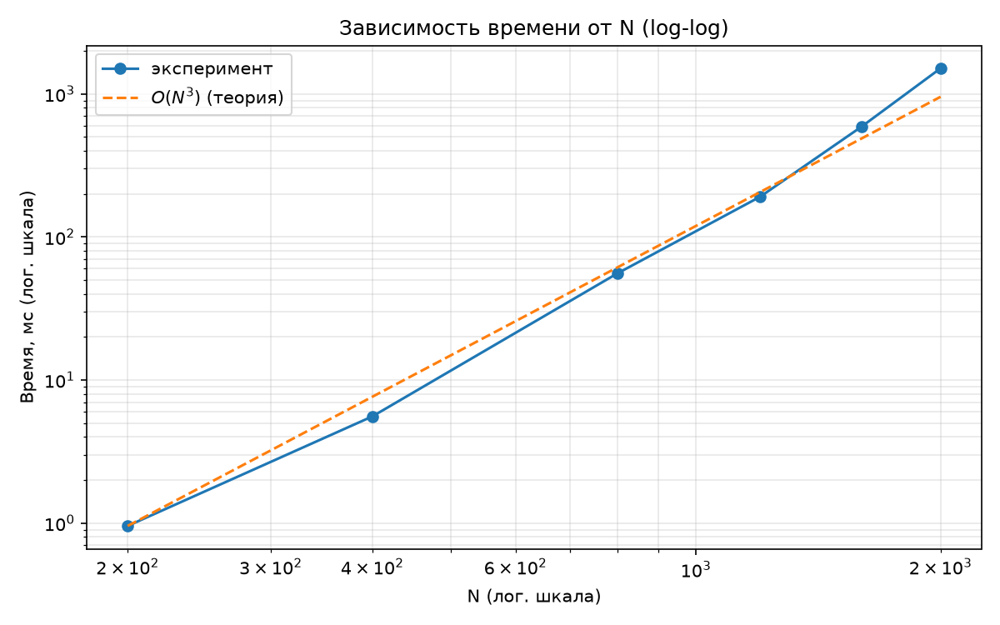

# Лабораторная работа по Параллельному Программированию №1.

**Выполнил Волков Ярослав, гр. 6212-100503D**

---

## Задание

Написать программу на C++ для перемножения двух квадратных матриц.
Исходные данные — файлы со значениями матриц. Выходные данные — файл
с результатом, время выполнения, объём задачи. Обязательна автоматизированная
верификация результатов с помощью сторонних библиотек (NumPy).

## Постановка задачи

Даны две квадратные матрицы $A, B \in \mathbb{Z}^{N \times N}$.
Требуется вычислить $C = A \cdot B$, где

$$C_{ij} = \sum_{k=1}^{N} A_{ik} \cdot B_{kj}.$$

**Объём задачи:** $2N^3$ арифметических операций.
**Вычислительная сложность:** $O(N^3)$.

## Структура проекта

```
lab1/
├── CMakeLists.txt      # сборка проекта
├── matrix_mul.cpp      # программа умножения (C++)
├── matrix_gen.py       # генератор матриц
├── verify.py           # верификация через NumPy
├── plot.py             # построение графиков
└── data/               # A{N}.txt, B{N}.txt, C{N}.txt
```

## Реализация

Умножение выполнено **тремя циклами вручную**, без использования сторонних
библиотек линейной алгебры — это позволяет в следующих работах распараллелить
вычисления.

Порядок обхода — `i-k-j`:

```cpp
for (int i = 0; i < n; ++i)
    for (int k = 0; k < n; ++k) {
        const int aik = a[i][k];
        const auto& brow = b[k];
        auto& crow = c[i];
        for (int j = 0; j < n; ++j)
            crow[j] += aik * brow[j];
    }
```

**Параметры сборки:**
- Компилятор: MSVC (Visual Studio 2026)
- Стандарт: C++23
- Оптимизация: `/O2` (конфигурация **Release**)
- Аппаратная платформа: ЦП: i5-13450HX ГП: RTX 5050 Laptop ОС: Windows 11 ОЗУ: 16 Гб, DDR5, 4800 MHz

Полный код — в `matrix_mul.cpp`, `matrix_gen.py`, `verify.py`.

## Методика экспериментов

Для $N \in \{200, 400, 800, 1200, 1600, 2000\}$:

1. Генерируются две случайные целочисленные матрицы $N \times N$
   (элементы равномерно из $[-9, 9]$).
2. Программа выполняет умножение и замеряет время через
   `std::chrono::high_resolution_clock`.
3. Выполняется **3** прогона, в таблицу заносится минимальный.
4. Корректность проверяется через `numpy.matmul`.

## Результаты экспериментов

| N | Мин. время, мс | $2N^3$ | GFLOP/s |
|--:|---------------:|-------:|--------:|
| 200  | 0.955    | 1.60·10⁷  | 16.75 |
| 400  | 5.568    | 1.28·10⁸  | 22.99 |
| 800  | 55.491   | 1.02·10⁹  | 18.45 |
| 1200 | 191.309  | 3.46·10⁹  | 18.07 |
| 1600 | 592.232  | 8.19·10⁹  | 13.83 |
| 2000 | 1510.205 | 1.60·10¹⁰ | 10.60 |

> **Исходные данные для графиков** — столбцы «N» и «Мин. время, мс».

Все проверки `verify.py` дали максимальную разницу **0**.

## Графики

### Зависимость времени от размера матрицы



### Логарифмические координаты (log-log)



> Прямая линия с наклоном ≈ 3 подтверждает кубическую сложность $O(N^3)$.

## Выводы

1. Программа корректно перемножает квадратные матрицы: все проверки через
   NumPy дали результат "ОК".

2. Время выполнения растёт как $O(N^3)$: при увеличении $N$ в 2 раза
   (200 → 400, 400 → 800) время растёт примерно в 6–10 раз, что соответствует
   теоретической оценке числа операций $2N^3$.

3. Пиковая производительность — **≈23 GFLOP/s** (N=400). При больших $N$
   производительность падает (до 10.6 GFLOP/s при N=2000) — узким местом
   становится пропускная способность памяти, а не арифметика CPU: матрицы
   перестают помещаться в кэш L2/L3.
   (данная информация получена с помощью китайских искусственных нейронных связей)


## Сборка и запуск

```bash
# 1. Сгенерировать матрицы (размер N меняется в matrix_gen.py)
python matrix_gen.py

# 2. Собрать (Release!)
cmake -B build -DCMAKE_BUILD_TYPE=Release
cmake --build build --config Release

# 3. Запустить из корня проекта
./build/Release/lab1.exe

# 4. Проверить
python verify.py

**повторить необходимое кол-во раз**

# 5. Построить графики
python plot.py
```

## Зависимости

- C++23, CMake ≥ 3.20, MSVC / GCC / Clang
- Python 3.10+ с `numpy`, `matplotlib`